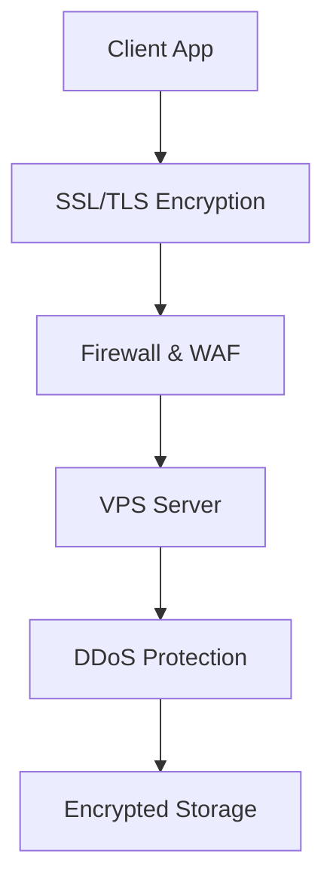

## Overview

SkyITVPS delivers reliable virtual and cloud servers tailored for businesses, especially those running accounting software. You benefit from high-stability infrastructure that ensures uninterrupted operations, lightning-fast performance for demanding applications, robust data security, and round-the-clock support. These features help you optimize office workflows, store sensitive financial data securely, and scale effortlessly as your business grows.

## Key Features at a Glance

<Columns cols={2}>
  <Card title="High-Stability Servers" icon="server" href="#high-stability-servers">
    Deploy cloud servers optimized for accounting software like 1C or QuickBooks with 99.99% uptime guarantees.
  </Card>
  <Card title="Speed Optimization" icon="zap" href="#speed-optimization">
    Accelerate business apps through NVMe storage and global CDN integration.
  </Card>
  <Card title="Advanced Security" icon="shield" href="#advanced-security">
    Protect your data with encryption, firewalls, and DDoS mitigation.
  </Card>
  <Card title="24/7 Support" icon="headphones" href="#support-monitoring">
    Get instant help and proactive monitoring tools for peace of mind.
  </Card>
</Columns>

## High-Stability Cloud Servers for Accounting

You can launch dedicated cloud servers fine-tuned for accounting workloads. These servers handle high-load tasks like batch processing and real-time reporting without downtime.

<Steps>
  <Step title="Choose Server Plan" icon="settings">
    Select a VPS or cloud instance with at least 4 vCPUs and 8 GB RAM for accounting software.
  </Step>
  <Step title="Deploy Software" icon="download">
    Install your accounting suite via one-click templates.

````bash
sudo apt update && sudo apt install -y 1c-enterprise-server
````

  </Step>
  <Step title="Configure Backup" icon="database">
    Enable automated snapshots for data recovery.

````bash
crontab -e
# Add: 0 2 * * * /usr/bin/snapshot-backup.sh
````

  </Step>
</Steps>

<Callout kind="tip">
  Start with a trial VPS to test stability under your specific accounting load.
</Callout>

## Speed Optimization for Business Applications

Optimize your office applications for peak performance. SkyITVPS uses SSD/NVMe drives and CPU bursting to handle spikes in traffic.

<Tabs>
  <Tab title="Web Apps" icon="globe">
    Enable caching for faster response times.

````javascript
// nginx.conf example
server {
  location / {
    proxy_cache my_cache;
    proxy_cache_valid 200 1h;
  }
}
````
  </Tab>
  <Tab title="Database" icon="database">
    Tune PostgreSQL for accounting queries.

````sql
-- postgresql.conf
shared_buffers = 256MB
effective_cache_size = 768MB
work_mem = 4MB
````
  </Tab>
  <Tab title="Office Tools" icon="file-text">
    Use Redis for session storage in collaborative tools.

````bash
redis-server --maxmemory 512mb --maxmemory-policy allkeys-lru
````
  </Tab>
</Tabs>

## Advanced Data Security Measures

Secure your financial data with layered protections. You get end-to-end encryption, intrusion detection, and compliance-ready setups.



<Expandable title="Compliance Details" default-open="true">
  SkyITVPS servers support GDPR and PCI-DSS standards. Enable two-factor authentication on your dashboard at `https://dashboard.skyitvps.com`.
</Expandable>

<ResponseField name="data_encryption" field-type="AES-256" required="true">
  All stored data uses industry-standard encryption.
</ResponseField>

<ResponseField name="backup_retention" field-type="string" required="false">
  Configurable retention up to 30 days.
</ResponseField>

## 24/7 Support and Monitoring Tools

Access expert support anytime via ticket, chat, or phone. Proactive monitoring alerts you to issues before they impact your operations.

<CodeGroup tabs="Prometheus,Grafana">
```yaml
# prometheus.yml for VPS monitoring
global:
  scrape_interval: 15s
scrape_configs:
  - job_name: 'vps-node'
    static_configs:
      - targets: ['localhost:9100']
```
```yaml
# grafana datasource config
apiVersion: 1
datasources:
  - name: Prometheus
    type: prometheus
    url: http://localhost:9090
```
</CodeGroup>

<Callout kind="success">
  Integrate monitoring in under 5 minutes to stay ahead of potential outages.
</Callout>

These core features empower you to run stable, secure, and efficient accounting operations on SkyITVPS. Start by provisioning a test server today.