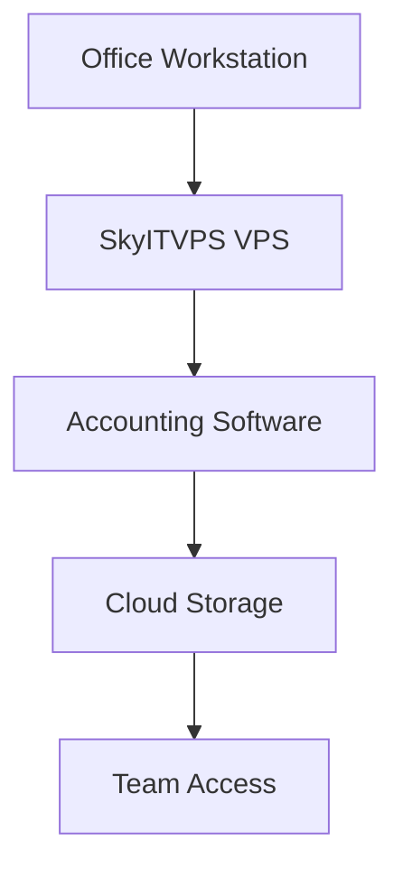

## Overview

SkyITVPS integrates seamlessly with popular accounting platforms to streamline your business operations. You can connect virtual servers to tools like QuickBooks or Xero for automated data syncing, set up webhooks for real-time updates, and optimize office workflows with cloud storage. Follow these guides to ensure stability, speed, and compliance.

<Columns cols={3}>
  <Card title="Accounting Integrations" icon="database" href="#accounting-integrations">
    Connect to QuickBooks, Xero, and more.
  </Card>
  <Card title="Webhook Setup" icon="zap" href="#webhooks">
    Automate workflows with real-time events.
  </Card>
  <Card title="Data Strategies" icon="shield" href="#data-storage">
    Secure and compliant storage tips.
  </Card>
</Columns>

## Accounting Platform Integrations

Connect SkyITVPS servers to leading accounting software for effortless data management. Use API endpoints to push transaction data or pull reports.

<Tabs>
  <Tab title="QuickBooks" icon="package">
    Install the SkyITVPS QuickBooks connector.

    <Steps>
      <Step title="Create API Key" icon="key">
        Generate a key in your SkyITVPS dashboard at `https://dashboard.example.com/api-keys`.
      </Step>
      <Step title="Configure Endpoint">
        Set the base URL to `https://api.example.com/v1/accounting/quickbooks`.
      </Step>
      <Step title="Test Sync">
        Run a test sync to verify transactions flow correctly.
      </Step>
    </Steps>
  </Tab>
  <Tab title="Xero" icon="shield">
    Use OAuth 2.0 for secure Xero integration.

    ```javascript
    const response = await fetch('https://api.example.com/v1/accounting/xero/sync', {
      method: 'POST',
      headers: {
        'Authorization': `Bearer YOUR_XERO_TOKEN`,
        'SkyITVPS-Key': `YOUR_API_KEY`
      },
      body: JSON.stringify({ organizationId: 'your-org-id' })
    });
    ```
  </Tab>
  <Tab title="FreshBooks" icon="users">
    Map invoices directly to your VPS storage.
  </Tab>
</Tabs>

<Callout kind="tip">
  Always test integrations in a staging environment before production to avoid data discrepancies.
</Callout>

## Setting Up Webhooks

Webhooks enable automated workflows, such as notifying your accounting software of new server events. Configure them via the SkyITVPS API.

<ParamField path="webhook_url" param-type="string" required="true">
  Your public endpoint, e.g., `https://your-webhook-url.com/skyitvps`.
</ParamField>

<ParamField header="SkyITVPS-Signature" param-type="string" required="false">
  HMAC signature for payload verification.
</ParamField>

Follow these steps to set up a webhook:

<Steps>
  <Step title="Register Webhook">
    ```bash
    curl -X POST https://api.example.com/v1/webhooks \
      -H "Authorization: Bearer YOUR_API_KEY" \
      -d '{"url": "https://your-webhook-url.com/skyitvps", "events": ["invoice.created", "server.up"]}'
    ```
  </Step>
  <Step title="Handle Payload">
    Verify the signature and process events like invoice creation.
  </Step>
  <Step title="Test Delivery">
    Trigger a test event from the dashboard.
  </Step>
</Steps>

<CodeGroup tabs="Node.js,Python">
  ```javascript
  app.post('/skyitvps', (req, res) => {
    const signature = req.headers['skyitvps-signature'];
    const payload = req.body;
    // Verify HMAC signature
    if (verifySignature(payload, signature, process.env.SKY_WEBHOOK_SECRET)) {
      console.log('New invoice:', payload.invoice);
    }
    res.status(200).send('OK');
  });
  ```
  ```python
  from flask import Flask, request
  import hmac

  app = Flask(__name__)

  @app.route('/skyitvps', methods=['POST'])
  def webhook():
      signature = request.headers.get('SkyITVPS-Signature')
      payload = request.data
      if verify_hmac(payload, signature, 'YOUR_SECRET'):
          print('New invoice:', request.json['invoice'])
      return 'OK', 200
  ```
</CodeGroup>

## Data Storage Strategies for Compliance

Implement secure storage on your SkyITVPS VPS to meet accounting regulations like GDPR or SOX.

| Strategy | Description | Best For |
|----------|-------------|----------|
| Encrypted Volumes | Use LUKS for disk encryption | Sensitive financial data |
| Automated Backups | Daily snapshots to S3-compatible storage | Disaster recovery |
| RAID Configurations | RAID 10 for speed and redundancy | High-traffic accounting apps |

<Expandable title="Advanced Compliance Setup" default-open="false">
  Enable audit logging:

  ```bash
  sudo apt install auditd
  sudo auditctl -w /var/log/accounting -p wa -k accounting-access
  ```

  Monitor logs for compliance reports.
</Expandable>

<Callout kind="alert">
  Regularly rotate encryption keys and restrict access to `>2` users for compliance.
</Callout>

## Office Optimization with Virtual Servers

Optimize your office setup by dedicating VPS resources to accounting tasks.



<Steps>
  <Step title="Provision VPS" icon="server">
    Select a plan with `>4` CPU cores and `>16GB` RAM for multi-user access.
  </Step>
  <Step title="Install Software">
    Deploy 1C:Enterprise or similar via Docker.
  </Step>
  <Step title="Enable Remote Access">
    Use RDP or VNC with VPN for secure office connections.
  </Step>
</Steps>

Integrate these practices to boost efficiency and security in your SkyITVPS environment.